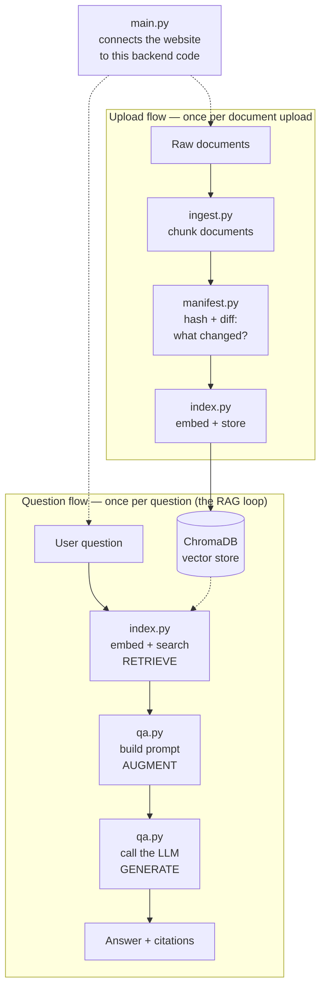

# The RAG Pipeline: What It Is, and Which File Does What

## What RAG actually is

**Retrieval-Augmented Generation** answers a question in three steps, run
every time a question comes in:

1. **Retrieve** — search a store of your own documents for the pieces most
   relevant to the question.
2. **Augment** — insert those retrieved pieces into the prompt you're about
   to send the LLM.
3. **Generate** — have the LLM write an answer using that context, instead
   of just guessing from what it memorized during training.

Why bother — especially when you could just upload a file straight to
ChatGPT and ask about it? Two reasons carry most of the weight:

**Data control.** Uploading a file sends its full contents to a vendor's
servers. Self-hosted retrieval keeps your documents and their embeddings in
infrastructure you control — only the handful of retrieved chunks plus the
question ever leave for the LLM call, not your whole corpus. For anything
under compliance rules (health records, legal, client contracts with
data-residency requirements), that's often the whole reason to build this
instead of using a vendor's built-in upload feature.

**Cost.** One person asking questions about one file is cheap either way. A
shared knowledge base fielding constant queries is not — RAG lets you run
the expensive part (retrieval) on infrastructure you control (this
project's embedding model runs locally, for free) and pay a vendor only for
the much smaller generation step, instead of paying per-request for a fully
hosted, black-box retrieval feature.

One more thing worth being precise about, since it's what makes the
data-control point work at all: **RAG doesn't train or fine-tune the
model.** The model's weights never change. At question time, the relevant
text gets retrieved and dropped straight into the prompt — closer to an
open-book exam than teaching the model new material. Because the model
never "learns" your documents, nothing about your private data needs to
reach a vendor except the specific snippets a given question actually
needs.

Worth naming explicitly, too: before any of the three steps above can
happen even once, your raw documents have to be turned into a searchable
form in the first place — chunked, embedded, and stored. That setup work
isn't one of the three RAG letters; it's the plumbing RAG depends on, and it
happens on a different schedule (once per upload) than
retrieve/augment/generate (once per question).

## The map: which file does what

Two separate flows share one vector store — documents get prepped and
stored on their own schedule (upload time), and questions get answered on
theirs (ask time):



| File | RAG stage | What it actually does |
|---|---|---|
| [ingest.py](backend/app/ingest.py) | Pre-retrieval (prep) | Loads raw documents and slices each one into overlapping, fixed-size chunks — small enough to embed and retrieve individually. |
| [manifest.py](backend/app/manifest.py) | Pre-retrieval (prep) | Hashes files and chunks so re-indexing only touches what actually changed, instead of reprocessing everything on every upload. |
| [index.py](backend/app/index.py) | **Retrieval (R)** | `index_folder()` embeds chunks into vectors and stores them in ChromaDB. `query()` embeds a question and finds its nearest chunks. |
| [qa.py](backend/app/qa.py) | **Augment + Generate (A + G)** | `build_prompt()` inserts retrieved chunks into the prompt (augment); `client.chat.completions.create()` calls the LLM (generate). Also owns the "not in docs" guardrail. |
| [main.py](backend/app/main.py) | Not RAG logic itself | The file that lets the website (frontend) trigger the Python code above it. It listens for requests like "someone clicked Ask" or "someone uploaded a file," and calls the right function in response. (Built with **FastAPI**, a toolkit for building this kind of "listen for a request, call some code, send back a response" layer — it does no retrieval or generation itself.) |
| [config_store.py](backend/app/config_store.py) / [models.py](backend/app/models.py) | Not RAG logic itself | Per-team settings (tone, answer format, citation requirements) that `qa.py` reads when building its prompt — customization, not retrieval or generation. |

## Walkthrough 1: uploading documents (the prep flow)

This runs once per upload, not once per question. Triggered by `POST
/index` in [main.py](backend/app/main.py), which calls `index_folder()` in
[index.py](backend/app/index.py):

1. `load_manifest()` — load what was indexed last time. *(manifest.py)*
2. `build_file_hashes(folder)` + `diff_hashes(...)` — figure out which files
   are new, changed, deleted, or untouched. *(manifest.py)*
3. For deleted files: remove their chunks from ChromaDB.
4. For new/changed files only: `build_chunks(folder, doc_names=...)` —
   re-chunk just those files. *(ingest.py)*
5. `build_chunk_hashes(chunks)` + `diff_hashes(...)` again, this time at the
   chunk level — figure out exactly which chunks within those files
   actually changed. *(manifest.py)*
6. Embed only the new/changed chunks (`SentenceTransformer`) and upsert them
   into ChromaDB. *(index.py)*
7. `save_manifest(...)` — persist the updated state for next time.
   *(manifest.py)*

Notice `ingest.py` and `manifest.py` only ever show up *inside* this prep
flow — neither one runs when a question is asked.

## Walkthrough 2: asking a question (the RAG loop)

This runs once per question. Triggered by `POST /ask` in
[main.py](backend/app/main.py), which calls `ask()` in
[qa.py](backend/app/qa.py):

1. `query(question)` — embed the question, ask ChromaDB for the top-k
   nearest chunks. **(Retrieve)** *(index.py)*
2. Check the closest match's distance against `DISTANCE_THRESHOLD` — if
   nothing is close enough, short-circuit with "I don't know" before
   touching the LLM at all.
3. `build_system_prompt(config)` — read this team's tone/format/citation
   settings and turn them into instructions for the model. *(qa.py, reading
   from config_store.py)*
4. `build_prompt(question, chunks)` — merge the retrieved chunks into the
   question as numbered context. **(Augment)** *(qa.py)*
5. `client.chat.completions.create(...)` — call the LLM with the system
   prompt and augmented prompt. **(Generate)** *(qa.py)*
6. Return the answer text plus which chunks it was grounded in, back
   through `main.py` to the frontend.

Everything in this second walkthrough is what [BACKEND_WALKTHROUGH.md](BACKEND_WALKTHROUGH.md)
calls "the actual RAG loop" — it's the only path where all three letters of
RAG happen in sequence, per question.

## Try it yourself: see the similarity scores

[scripts/ask.py](backend/scripts/ask.py) is a small command-line tool that
runs the RAG loop directly and prints each retrieved chunk's **similarity
score** next to the answer — no frontend needed.

This assumes documents are already indexed (upload something through the
frontend, or `POST` to `/index`, at least once first — otherwise there's
nothing to retrieve from).

From `backend/`, with its venv:

```bash
./.venv/bin/python scripts/ask.py
```

Type a question and hit enter. You'll get something like:

```
Postgres was chosen for per-team config storage in Phase 5.

## References
[1] PLAN.md (chunk 4, similarity=0.81)
[2] PLAN.md (chunk 2, similarity=0.64)
```

**How to read the number:** similarity runs roughly 0 (unrelated) to 1
(near-identical match) — it's just `1 - distance` from
[qa.py](backend/app/qa.py). If the *closest* chunk's similarity drops below
about 0.25, the guardrail kicks in and the bot answers "I don't know"
instead of guessing — that's `DISTANCE_THRESHOLD = 0.75` in
[qa.py:19](backend/app/qa.py), mirrored on the similarity scale.

Try a question you know is answered clearly in the docs, then a question
you know isn't — watching the scores move is the fastest way to build
intuition for what "good retrieval" actually looks like.
